# Metal Slug: OOP Project

A 2D side-scrolling run-and-gun game inspired by **Metal Slug**, written in **C++** with **SFML 2.6**.
It was made as an Object Oriented Programming course project (roll numbers **25I-0504** and **25I-0644**). The whole game is built around class hierarchies, inheritance, polymorphism and the state pattern.

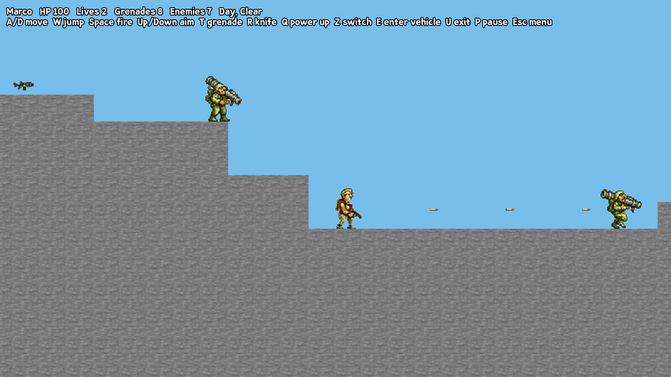

---

## Features

- **4 playable characters**: Marco, Tarma, Eri and Fio, each with different stats (fire rate, speed, grenades). Switch between them at any time. Each has 3 lives.
- **A 200-block-wide world in 3 areas**: rocky mountains, grassy plains and the sea, generated from a tile (voxel) grid.
- **Weapons:** pistol, Heavy Machine Gun, Rocket Launcher, Flame Shot and Laser Gun pickups, plus grenades and a knife.
- **Enemies with a state-machine AI** (roaming → chasing → attacking):
  - Rebel soldier
  - Bazooka soldier
  - Grenade soldier
  - Shield soldier, who blocks bullets from the front
- **Vehicles you can drive:** Metal Slug tank, Slug Flyer plane, Slug Mariner submarine and Amphibious Slug.
- **Enemy vehicles:** M-15A Bradley tank, Flying Tara bomber and an enemy submarine.
- **Day and night cycle:** the sky changes colour, the sun and moon move across it, and the level gets darker at night.
- **Weather:** clear, rain and snow on a repeating schedule. Rain and snow turn the sky grey.
- **Effects:** explosions, walking animations, a HUD, pause, game over and mission complete screens.

## Screenshots

### Main menu
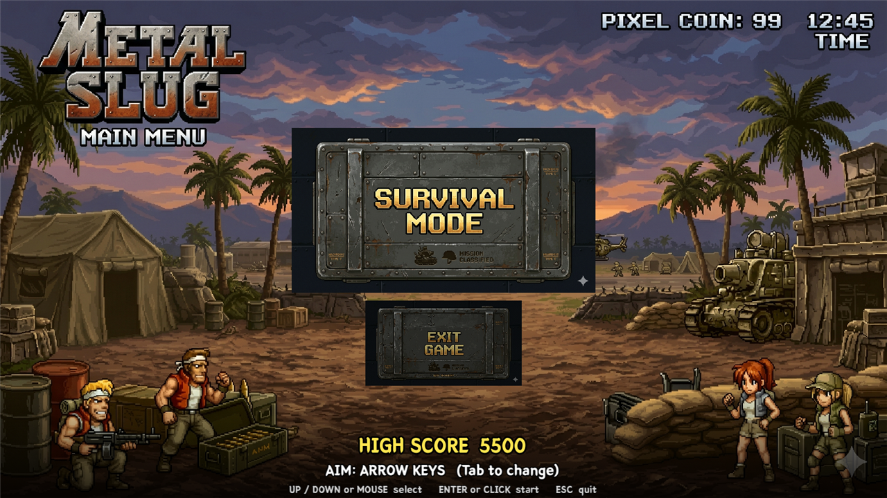

### Playable characters
Marco, Tarma, Eri and Fio. Press **Z** to switch.
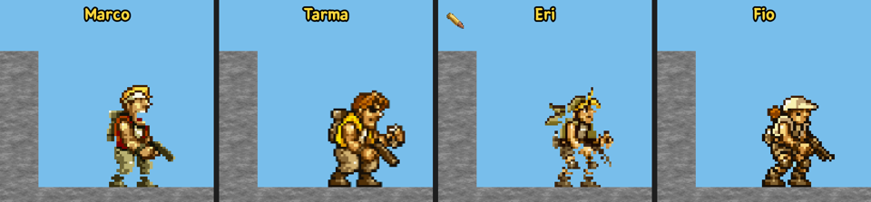

### Weapons and combat
| Heavy Machine Gun pickup | Grenade explosion |
|---|---|
| 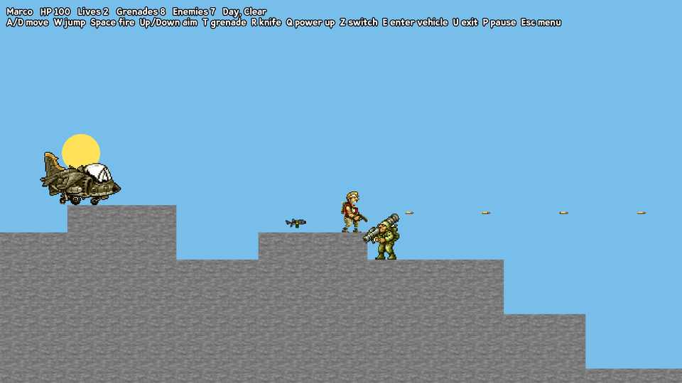 | 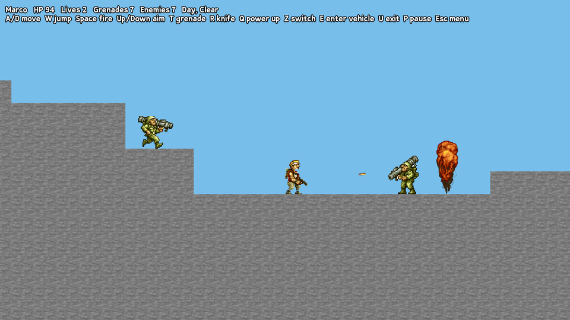 |

### Enemies
| Shield soldier and bazooka soldier | Grenade soldier |
|---|---|
| 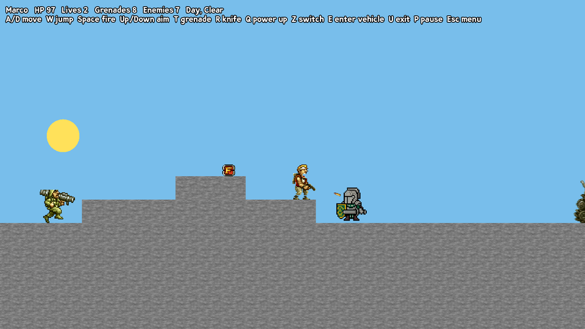 | 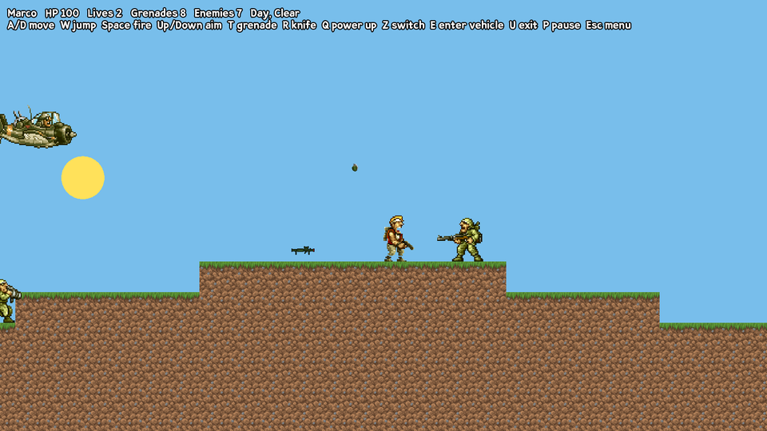 |
| **Flying Tara bomber** | **M-15A Bradley tank** |
| 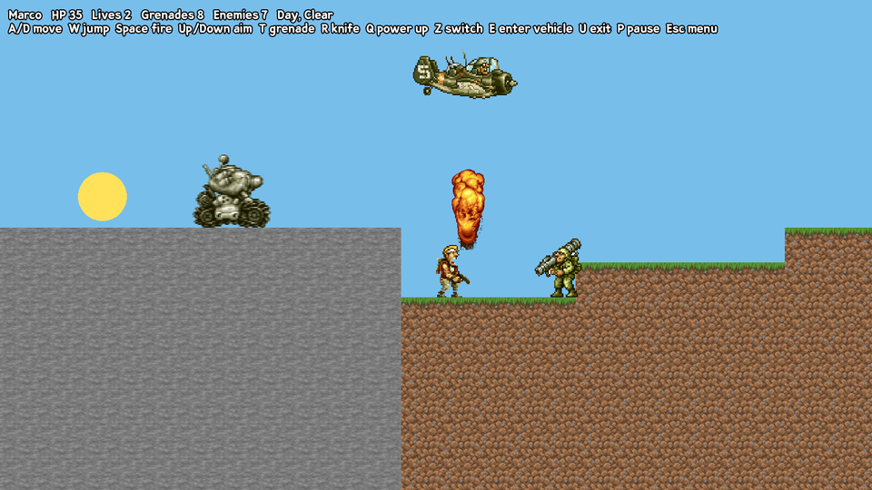 | 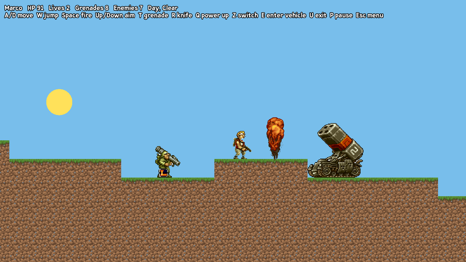 |

### Vehicles
| Metal Slug tank | Slug Flyer plane |
|---|---|
| 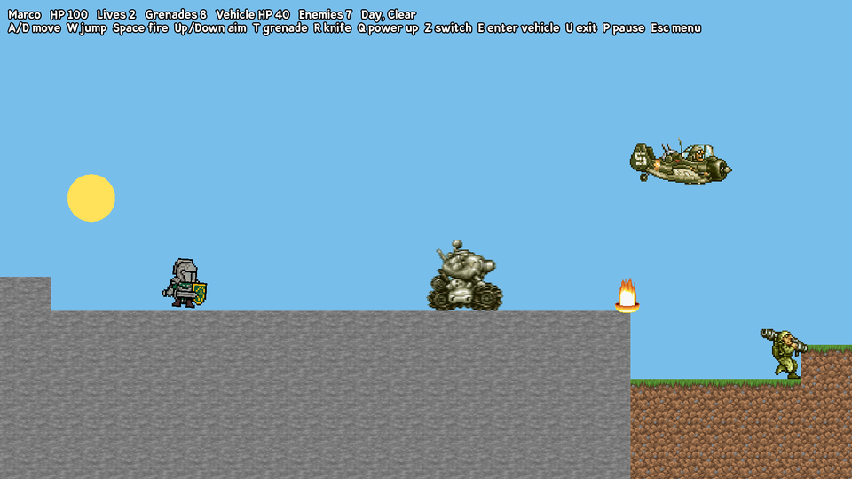 | 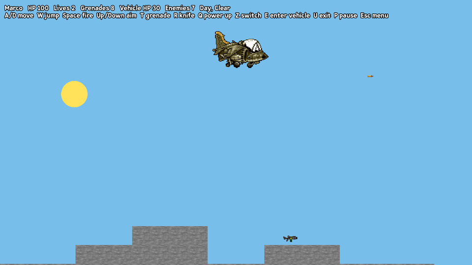 |
| **Slug Mariner vs. enemy submarine** | |
| 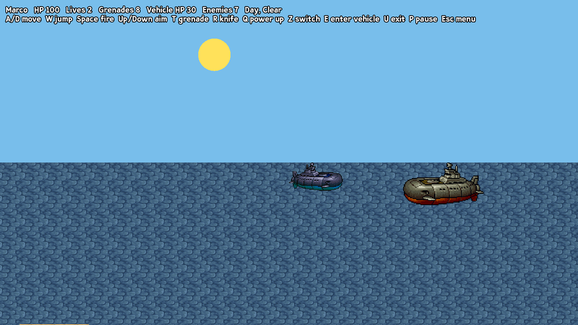 | |

### Day and night cycle
| Sunset | Night |
|---|---|
| 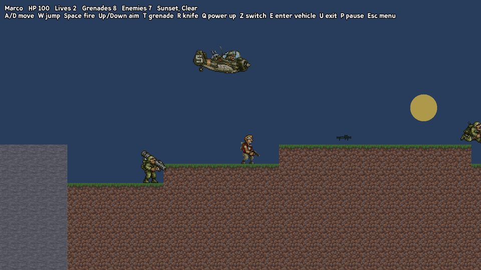 | 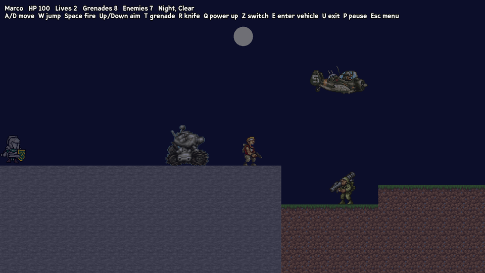 |

### Weather
| Rain (at night) | Snow |
|---|---|
| 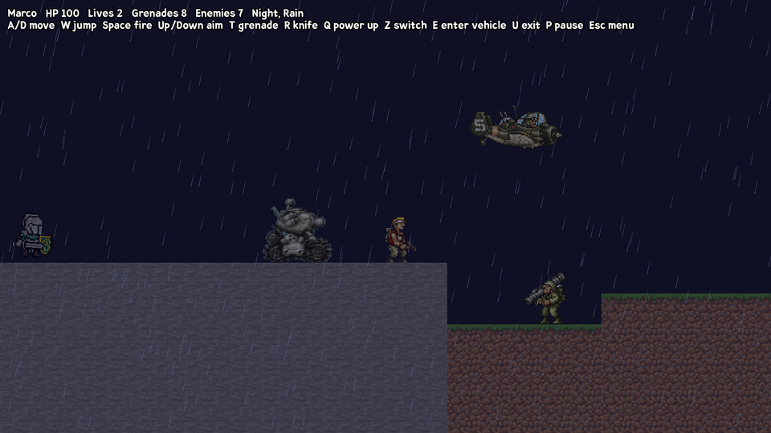 | 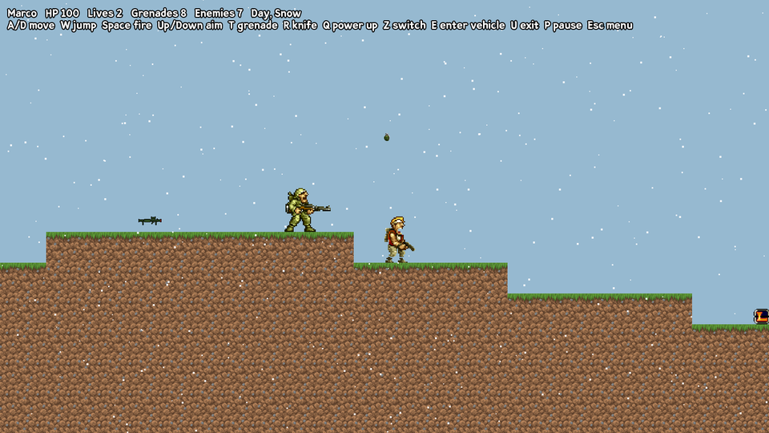 |

### End screens
| Mission complete | Game over |
|---|---|
| 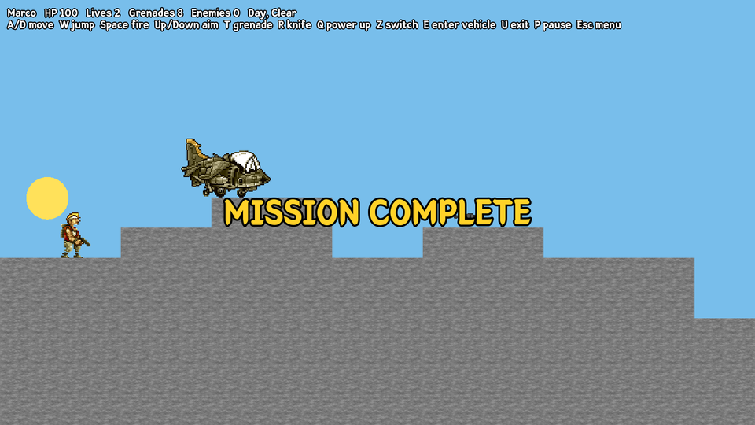 | 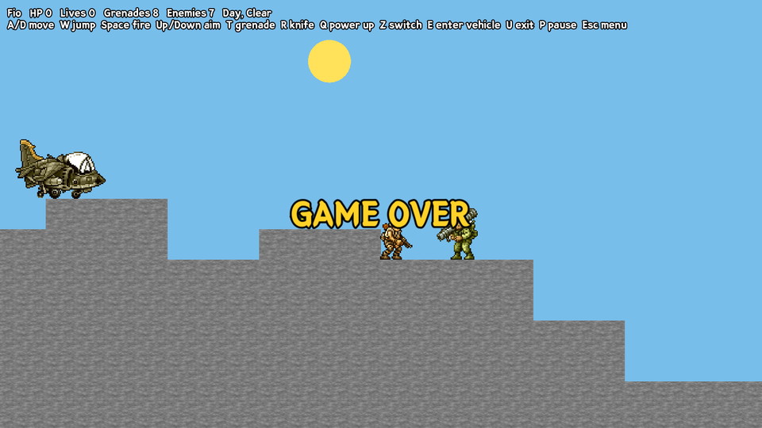 |

## Controls

| Key | Action |
|---|---|
| **A / D** | Move left / right |
| **W** | Jump |
| **Space** | Fire |
| **Up / Down** | Aim up / down |
| **T** | Throw grenade |
| **R** | Knife |
| **Q** | Character power-up (faster firing for a while) |
| **Z** | Switch character |
| **E** | Enter a vehicle (stand next to it) |
| **U** | Exit the vehicle |
| **P** | Pause |
| **Esc** | Back to the menu (quits from the menu) |
| **Enter / Up / Down** | Menu navigation |

**Inside vehicles:**
- Metal Slug: A/D to drive, W to jump, Space for the cannon.
- Flyer, Mariner and Amphibious Slug: arrow keys to move.
- Slug Flyer: R fires missiles.
- Slug Mariner: D, W and A fire missiles forward, up and backward.

## Building and running

### Windows (Visual Studio)
1. Install **SFML 2.6.x** (the Visual C++ 64-bit build) to `C:\SFML-2.6.1`. Or change the include and library folders in the project properties to wherever you put it.
2. Open `OOP_PROJECT.slnx` in Visual Studio (the project uses toolset v145).
3. Select **Debug | x64** and build.
4. Copy the SFML debug DLLs (`sfml-graphics-d-2.dll`, `sfml-window-d-2.dll`, `sfml-system-d-2.dll`) from `SFML\bin` next to the `.exe`.
5. Run it from Visual Studio. The working directory has to be the `OOP_PROJECT/OOP_PROJECT` folder, because the assets are loaded with relative paths.

### Linux
```bash
sudo apt install libsfml-dev
cd OOP_PROJECT/OOP_PROJECT
g++ -std=c++17 *.cpp -o metalslug -lsfml-graphics -lsfml-window -lsfml-system
./metalslug
```

## Project structure

```
OOP_PROJECT/
├── OOP_PROJECT.slnx               Visual Studio solution
└── OOP_PROJECT/
    ├── *.h / *.cpp                game source (one class or class family per file)
    ├── 25I-0504_25I-0644_Assets/  sprites, tiles, menu images
    ├── TEXT/font1.ttf             HUD font
    └── SPRITE/                    original sprite sheets the assets were cut from
```

### Main classes

| Area | Classes |
|---|---|
| Game loop and screens | `Game`, `GameStateManager`, `GameState` → `MenuState`, `PlayState` |
| World | `World`, `Voxel`, `Camera`, `Level`, `LevelManager` |
| Entities | `Entity` → `DamagableEntity` → `Soldier` → `PlayerSoldier`; `Player` (the 4 characters) |
| Enemies | `Enemy` → `RebelSoldier`, `ShieldedSoldier`, `BazookaSoldier`, `GrenadeSoldier` |
| Enemy AI | `EnemyAiState` → `RoamingAround`, `runningState`, `AttackingState`, `Descending` |
| Character states | `TransformativeState` → `NormalState`, `UndeadState`, `MummyState` |
| Vehicles | `Vehicle` → `GroundVehicle` (`MetalSlug`, `M15Bradley`, `AmphibiousSlug`), `AerialVehicle` (`SlugFlyer`, `FlyingTara`), `AquaticVehicle` (`SlugMariner`, `EnemySub`) |
| Weapons | `Weapon` → `ProjectileWeapon` → `Pistol`, `HeavyMachineGun`, `RocketLauncher`, `FlameShot`, `LaserGun`; `WeaponCollectible` |
| Projectiles | `Projectile` → `StraightProjectile` (`Bullet`, `Rocket`, `FireStream`, `LaserBeam`), `BallisticProjectile` (`NormalGrenade`, `FireBombGrenade`) |
| Effects | `EntityManager`, `Explosion`, `DayNightCycle`, `Weather` → `ClearWeather`, `Rain`, `Snow`; `WeatherSystem` |

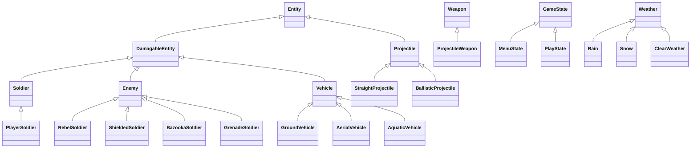

### OOP concepts used
- **Inheritance:** every object in the game is an `Entity`. Anything that can be hurt is a `DamagableEntity`, which owns the HP, gravity and tile collision code.
- **Polymorphism:** `EntityManager` keeps arrays of base-class pointers (`Enemy*`, `Vehicle*`, `Projectile*`) and calls virtual `update()`, `render()` and `applyDamage()` on them. The same applies to `Weather*` and `GameState*`.
- **Abstract classes:** `Entity`, `Projectile`, `Weapon`, `Vehicle`, `GameState`, `EnemyAiState` and `Weather` have pure virtual functions.
- **State pattern:**
  - screens: `GameState`
  - enemy AI: `EnemyAiState`
  - character transformations: `TransformativeState`
- **Encapsulation and composition:** `Player` owns 4 `PlayerSoldier`s, `Soldier` owns its `Weapon`s, `PlayState` owns the `World`, `EntityManager`, `DayNightCycle` and `WeatherSystem`.

## Credits

- Metal Slug characters, enemies, vehicles and effects are © SNK. The sprites come from fan-ripped Metal Slug sprite sheets (rippers are credited inside the sheets in the `SPRITE` folder).
- This is a non-commercial student project made only for learning.
